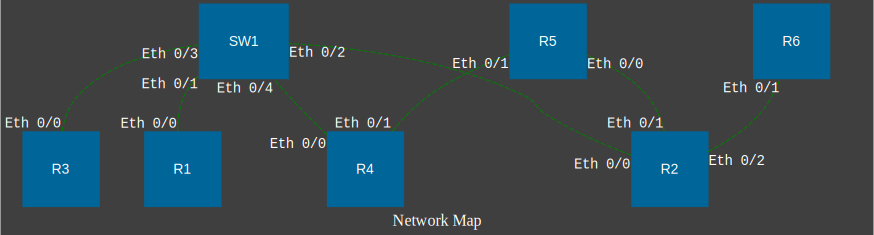

Данный скрипт был написан при выполнении учебной практической работы в ВУЗе. 

[Текст задания](https://github.com/lapetitemort-repos/python_course/blob/main/tasks/topology-drawer/Description.md)

# Краткое описание 🤩
Данный скрипт получает на вход данные о взаимных подключениях сетевый устройств и выводит картиночку топологии данной сети.

# Более подробное описание 🫣
Входные данные являются отчетами, полученными с помощью команды `show cdp neighbors`, данная команда используется на оборудовании cisco и позволяет посмотреть какие устройства подключены к выбранному вами устройству
Файлы приложены в таком формате:
```
R1>show cdp neighbors
Capability Codes: R - Router, T - Trans Bridge, B - Source Route Bridge
                  S - Switch, H - Host, I - IGMP, r - Repeater

Device ID        Local Intrfce     Holdtme    Capability  Platform  Port ID
SW1              Eth 0/0           140          S I      WS-C3750-  Eth 0/1
```

На вход в скрипт подается папка с похожими файлами, которые я построчно обрабатываю и получаю информацию о подключениях одного к многим, эту информацию я сохраняю в список, а после с помощью библиотеки `graphviz` выдаю картиночку такого вида:

<p align="center">
  
</p>

